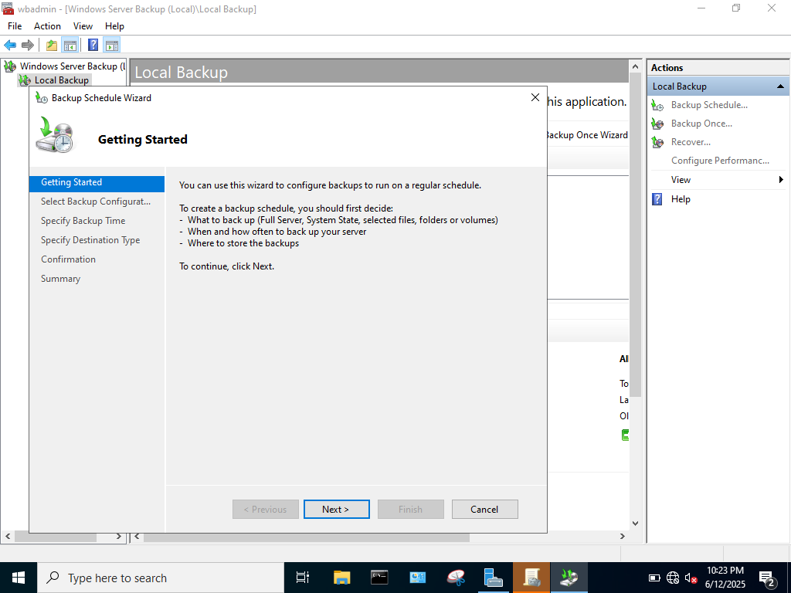
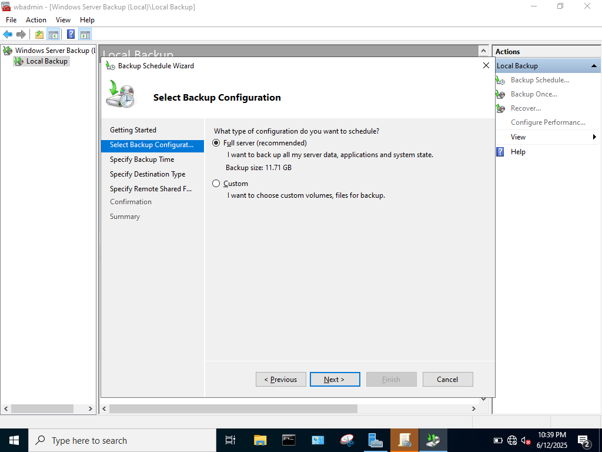
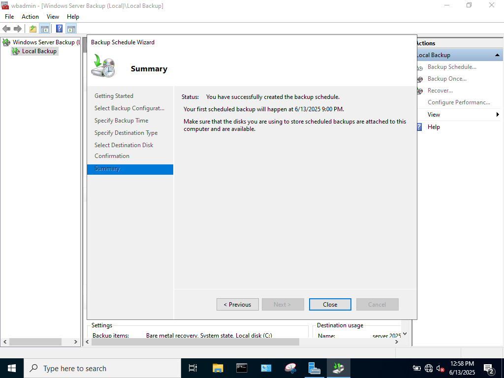

### OVERVIEW

In this lab, I will create a scheduled full backup of Windows Server using a virtual hard disk in Oracle Virtualbox. Technology can fail, so the admin is expected to be prepared for situations in which the server may become corrupted. Creating backups allows a machine to roll-back to a previous iteration, undoing any harm that may have rendered the server inoperable. 

### STEPS

First, a virtual hard disk must be created in the VM software which is where the backup will be stored:

Oracle Virtualbox > SERVER > Settings > Storage > Add Attachment > Hard Disk

Specify the amount of space needed on this VHD, the Windows Server is roughly 12 Gb large, so 20 Gb were alloted to the drive to have ample space for any future iterations. 

Now the VHD needs to be mounted to the SATA Controller, do this by selecting the Add Hard Disk option to the right of Controller:SATA and select the newly created VHD. 

Now that the VHD is properly mounted to the machine, Windows Server can be booted to initialize the VHD  using the Windows Disk Management software. 

Upon opening Disk Management, a prompt should appear to initialize the disk. Once that is completed, right-clicking the unallocated space will allow for a new volume to be created on the VHD. 

Now that the VHD is a recognized drive in Windows Server, the Windows Server Backup utility can be used to create the backup. 

Server Manager > Manage > Add Roles and Features > Features > Select Windows Server Backup

Once installed, the Windows Server Backup can be opened in the tools tab.

Server Backup > Local Backup > Actions > Backup Schedule

In this wizard, either a full backup or specific files can be selected to backup. A full backup will be created to ensure the entire configuration of the server is redundant. 

Next the time and frequency of recurring backups must be selected. Windows Server must be backed up at least once a day. For this lab 9 P.M. is chosen as the daily backup time. 

Now, the wizard prompts us to choose a storage location for the backup. The backup can be placed on a separate hard disk, a separate volume on the disk used for the server, or can be backed up on a shared network folder. The VHD created will allow for a backup on a separate hard disk, which is the Windows recommended option because it allows for the backup to be directly connected to the server without it being on the exact same HD the server is on, which would be an issue if the disk became corrupted. 

After finishing the Backup Schedule Wizard, a new backup is created!

### WHAT I LEARNED

### WHAT'S NEXT

