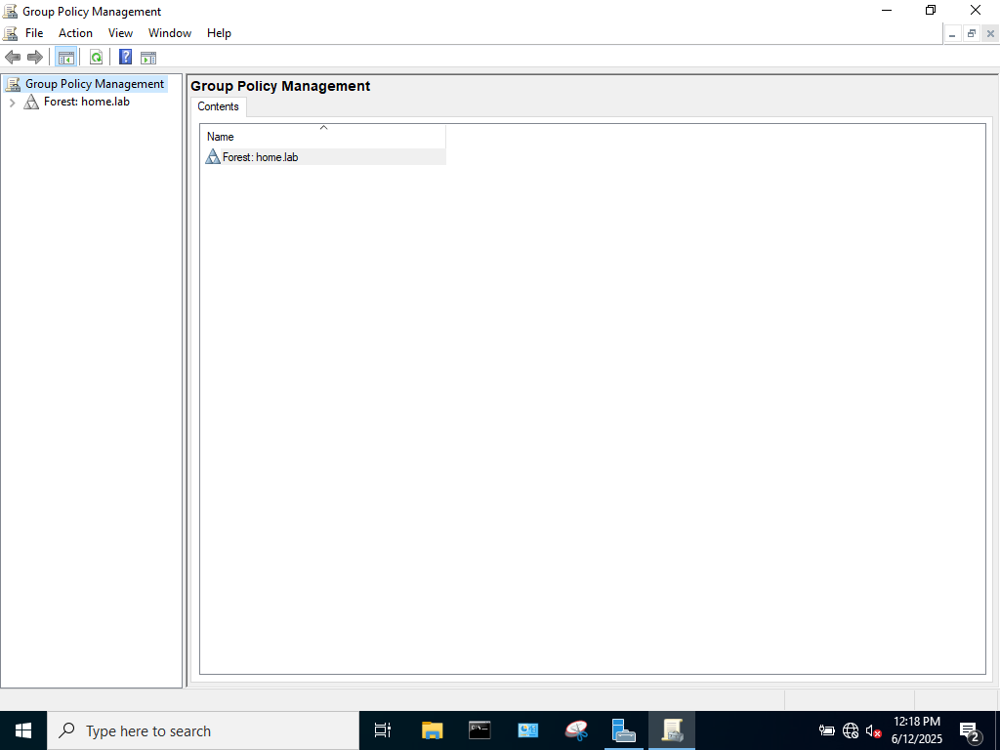
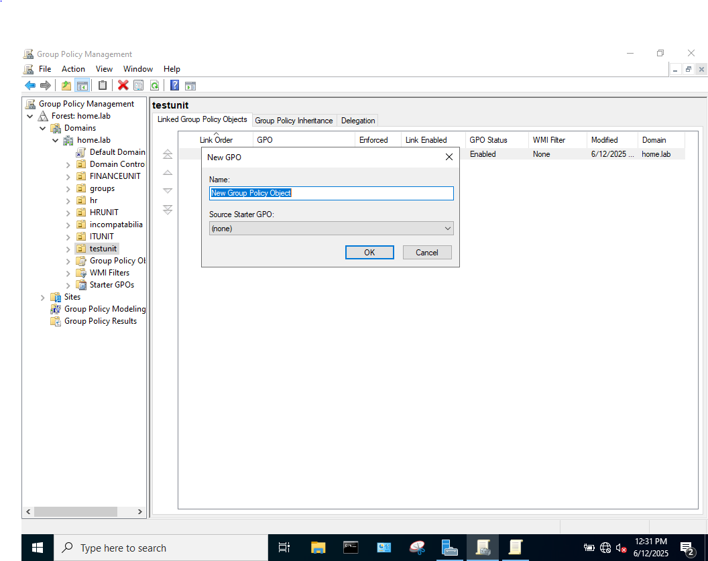
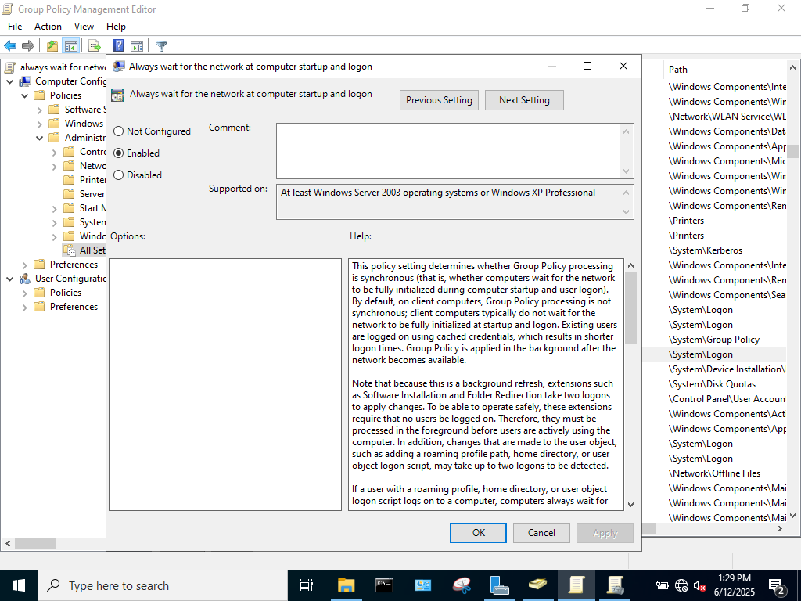
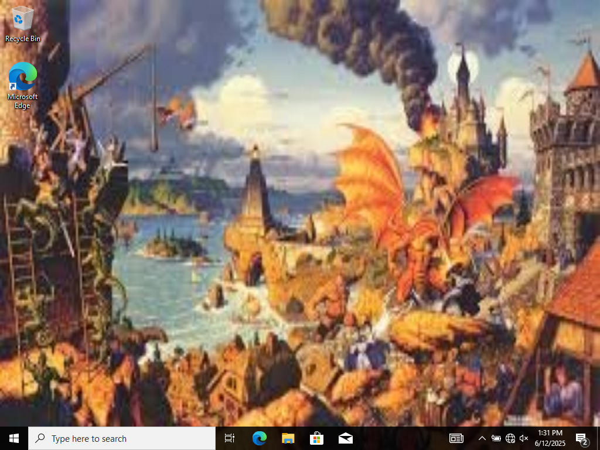

### OVERVIEW

In this lab, I will configure a Group Policy Object (Desktop Wallpaper) and apply that policy to a user (testuser) in an Organizational Unit. 

### STEPS 

What is a Group Policy?

Group Policies are settings that can be applied to Organizational Units that determine restrictions placed on the end-user. For example, in an enterprise environment, an admin may not want the end-user to have access to certain features such as the command line or control panel. With Group Policies, the admin can disable end-user access to these features.

First, a new user(usertest) will be placed in a new Organizational Unit (testunit), to test the application of the group policies. It is important that the intended 

A group policy will be created to change the default desktop wallpaper of the users wihin the OU

To create a new group policy:

Open Server Manager

Select Tools

Select Group Policy Management

Now that Group Policy Management is open

Open Forest

Domain

server (home.lab)

right-click OU (testunit)

Create a GPO in this domain and link here

Name the GPO(I named mine desktop background)

Now that the Group Policy Management editor is open

select User Configuration

Policies

Administrative Templates

Desktop

Desktop

Desktop Wallpaper

This will open up a new window to edit this specific GP. By default, this policy is unconfigured, change it to enabled. 

To place the desired image in the group policy, the fully qualified path to the image file must be entered. i.e. \\server\shares\uo_wallpaper.png (NOTE: the client PC must have both sharing and security permissions to at least read the file where the image is located)

NOTE: Initially, I set the path to C:\Users\user\Desktop\shares\uo_wallpaper.png. This did not properly load the image on the client PC because while using this path, the client PC searched its own C drive and not the C drive of the server.

After changing the path to the image, this still did not produce the desired results, After some research, it seems that the client PC would boot before properly connecting to the domain. Fixing this requres the GP "Always wait for the network at computer startup and logon" to be enabled. 

To enable this policy in the Group Policy Management Editor:

Go to Computer Configuration

Policies 

Administrative Templates

System

Group Policy

Always wait for the network at computer startup and logon

After enabling this policy, the client PC's desktop wallpaper was properly configured to what the Group Policy dictated. 

### WHAT I LEARNED

In this lab, I learned how to enact Group Policies on Organizational Units using the Group Policy Management editor. I learned that issues can arise with the GP whenever the client boots before properly connecting to the domain network.

### WHAT'S NEXT

I think digging through the possibilites offered by Group Policies would be worthwhile. It seems like there are hundreds and hundreds of policies you can apply to users in the domain. This would enable the admin to tightly regulate the network. I think for my next lab I would want to either map a network drive, or maybe start digging into some simple scripting. 