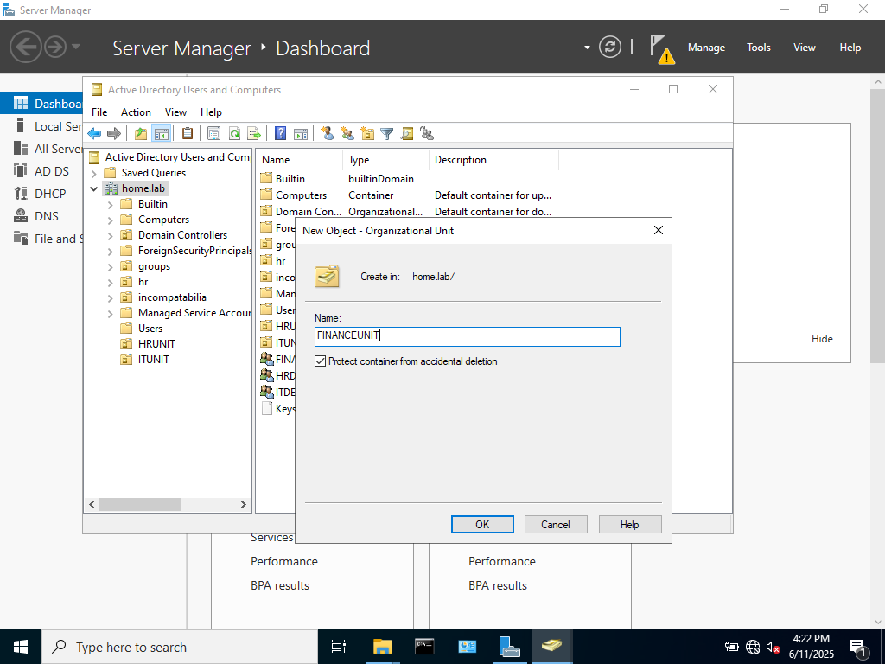
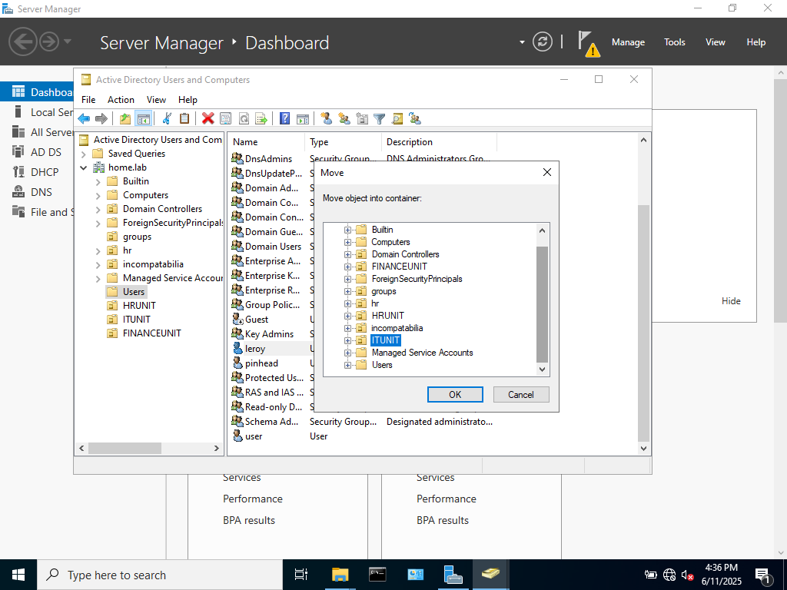
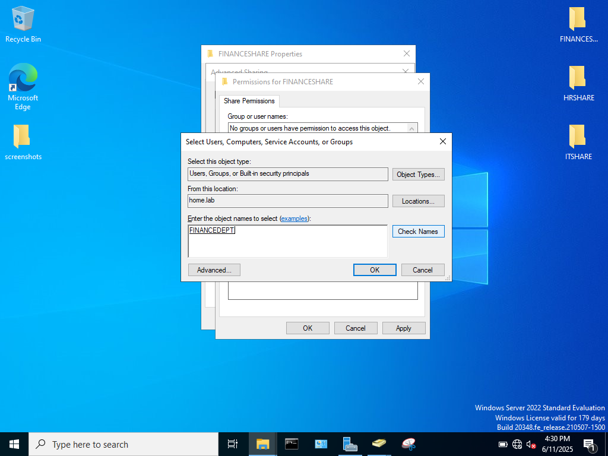
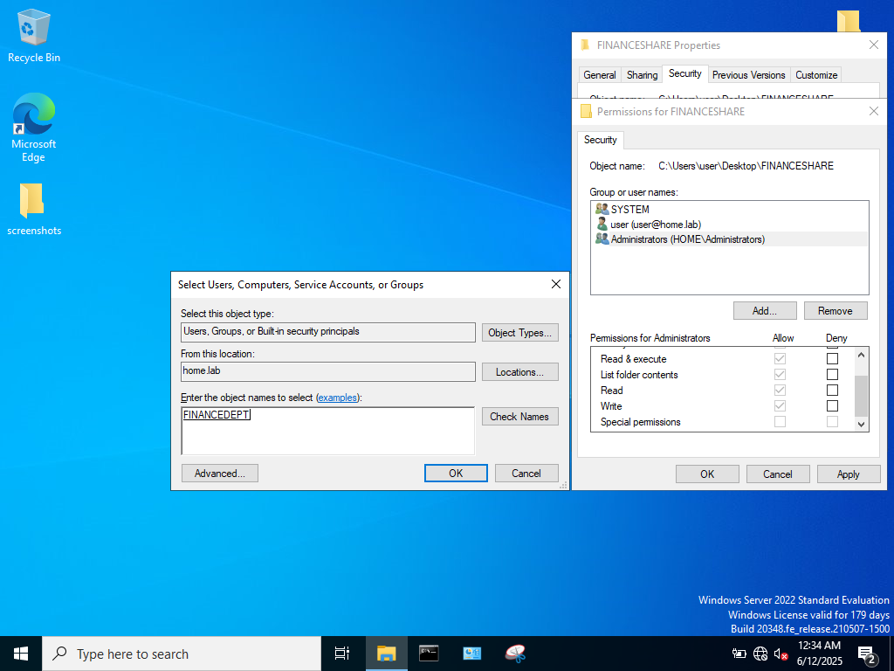
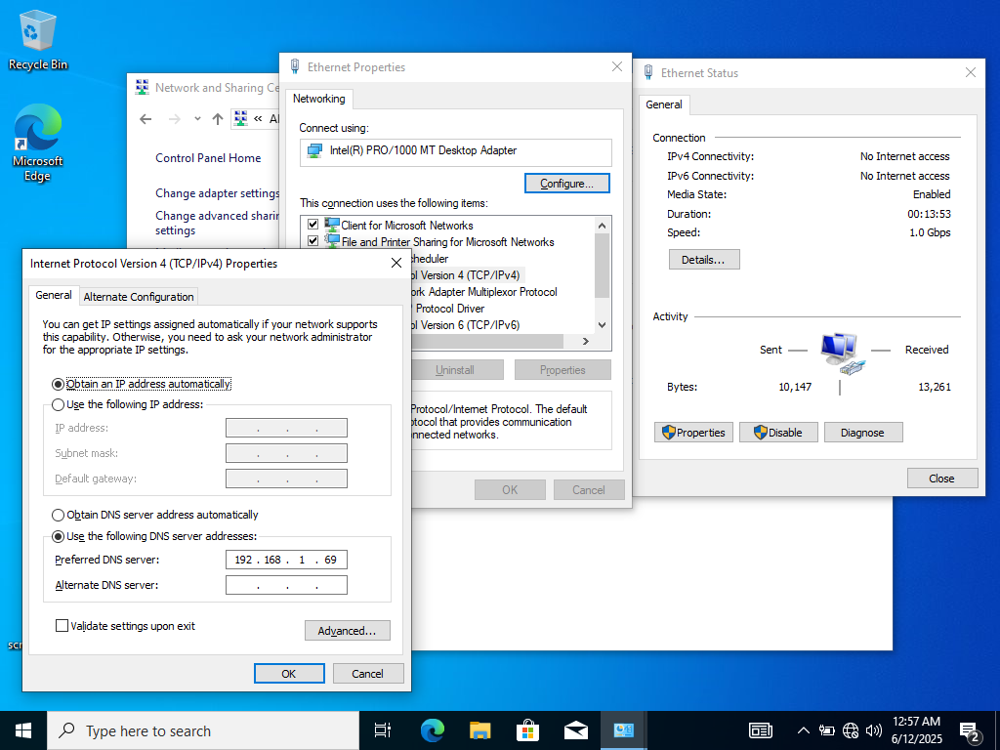
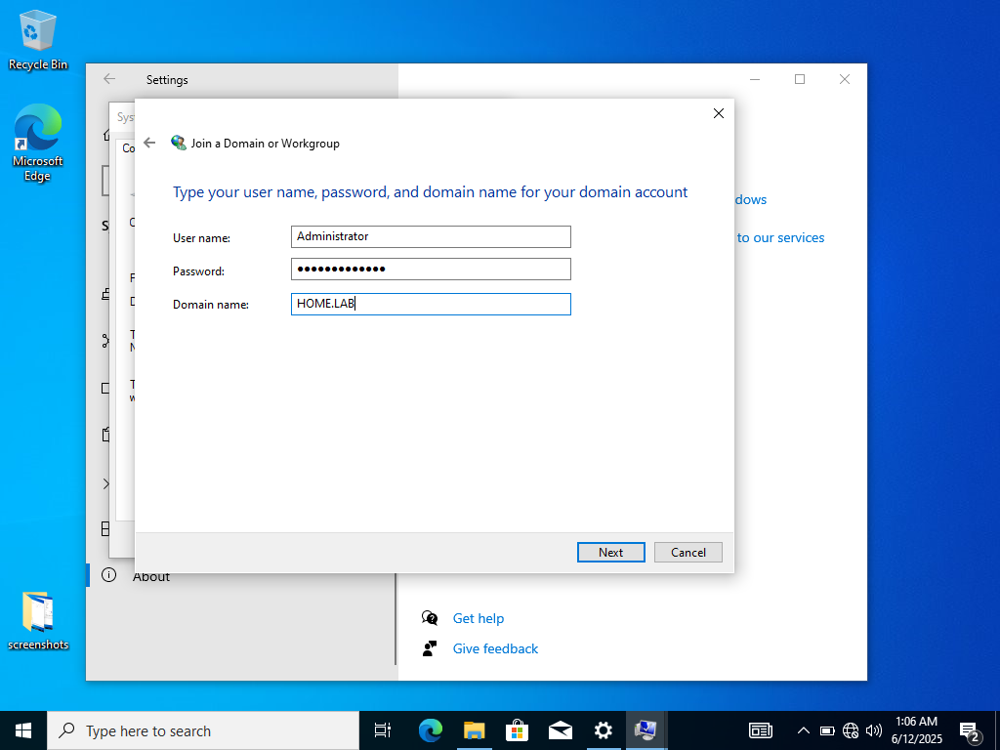
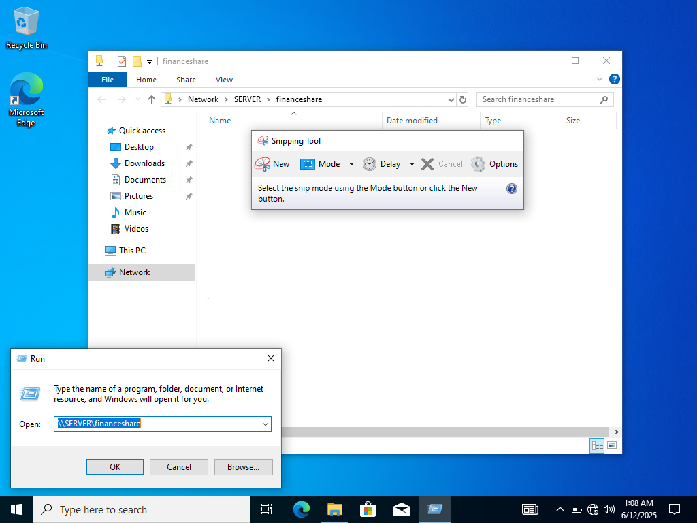

### OVERVIEW

In this lab, I will create Organization Units (OUs), move users and groups to OUs, enable the server to share files with the client,and connect a client PC to the server.

### STEPS

Creating Organizational Units:

An organizational unit is like a folder within AD which allows an admin to logically organize the users, groups, and computers in the domain.

Creating an OU is similar to creating a user or group
*right-click domain name (home.lab)
*New
*select Organizational Unit

Three OUs were created: FINANCEUNIT, HRUNIT, and ITUNIT.

Moving Users and Groups into an OU:

While adding users to groups enables file permissions, moving users to organizational units will allow for group policies to be enacted upon the users (which I will cover at a later time).

NOTE: Adding a group to an OU will not affect the users of the group(unless they happen to already be apart of that OU). Adding groups to an OU is mostly for logically structuring the domain. 

*Right-click user/group
*select Move
*Select OU to move user/group to 

File Sharing to Groups:

The Folder FINANCESHARE was created to share resources with the users of the finance group. Sharing and security permissions of the folder have to be changed for the users to be able to access this folder.

To change sharing permissions
*Right-click Folder
*Select Properties
*Sharing
*Advanced Sharing
*Remove everyone & add group FINANCEDEPT

To change security permissions
*Right-click Folder
*Select Properties
*Security
*Edit
*add group FINANCEDEPT

Changing these permissions will enable the server to share this folder with users of the specified group, however now a new problem arises: getting the client and the server to communicate across the network. 

Connecting a client PC to the Server:

In order for a pc to join and communicate with an AD environment, it's preferred DNS server must be set to the IP address of the domain controller. Without this configuration, the client will have no way of knowing that the domain controller and AD environment exist. 

To set the DNS preferences
*Control Panel
*Network and Sharing Center
*Access Type Connections
*Properties
*(TCP/IPv4)
*Properties
*Use the following DNS server addresses:(Server_IP)

Now with the DNS server properly configured, the client can join the domain offered by the server.

To join Domain Services
*Settings
*about
*Rename this PC (Advanced)
*Network ID
*Enter User name, Password, and Domain name

Now to access the shared Files on the client pc
*windows + R
*\\Server\ShareName

### WHAT I LEARNED

I learned a lot in this one, mostly to not forget to set the VMs network adapter to Bridged Mode :P One thing I need to keep track of is the distinction between an organizational unit and a group. On the surface it seems like that would do much the same thing but their purpose is quite different. One thing I forgot to explain in this lab that is essential for a client to communicate with the Domain Controller is to set a static IP address on the server. I will touch on that in another lab. 

### WHAT IS NEXT

I feel at this point, I could go in a lot of directions. This lab was necessary to be able to explore Group Policies in the future. I am intrigued by the idea of scripting various tasks. Also creating routine server back-ups would be an interesting experience. I am having a lot of fun doing this stuff. I want to continue to explore the possiblites offered by running these VMs. 
