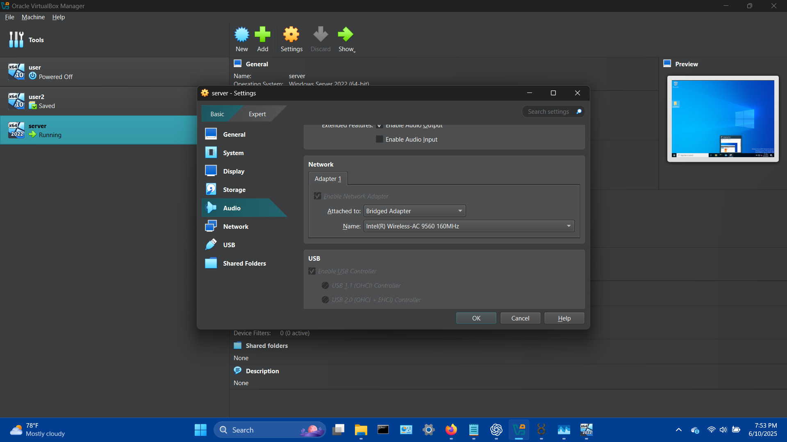
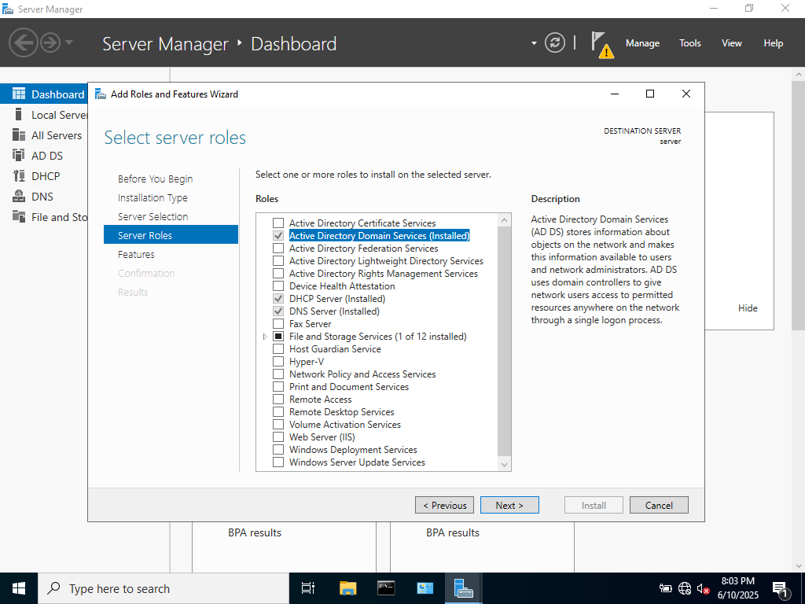
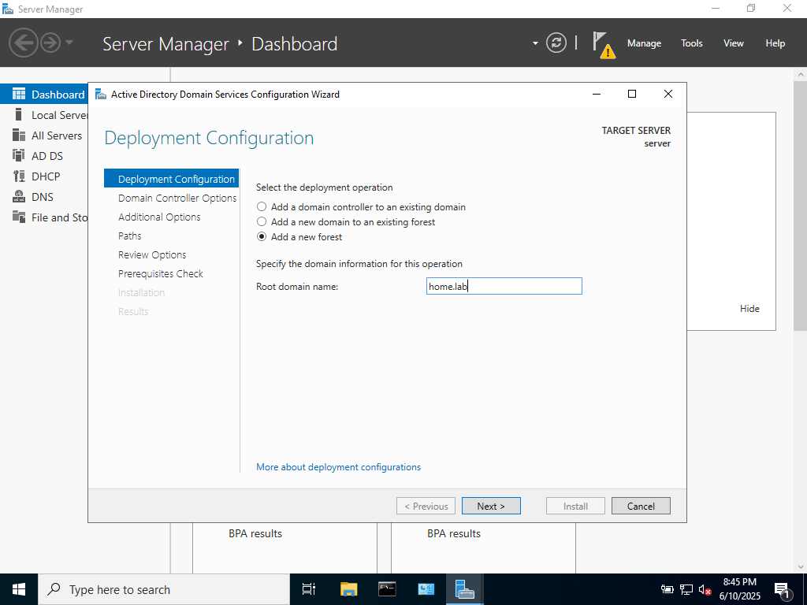

## OVERVIEW

This project concerns setting up Active Directory Domain Controller on Windows Server 2019. This server was built using Oracle VirtualBox

### Steps

I changed the VM’s network adapter from NAT to bridged mode to allow the machine to communicate directly on the local network.

After the Windows Server Installation Process, install Active Directory Domain Services on Server Manager. 

Manage > Add Roles and Features > Server Roles > Active Directory Domain Services (Also added DNS and DHCP for later)

Once Domain Services have installed, deployment configuration must be set up.

This gives you the option to either add a domain controller to an existing domain, add a new domain to an existing forest, 

or create an entirely new forest. Since this is an entirely new domain environment, a new forest will be created

