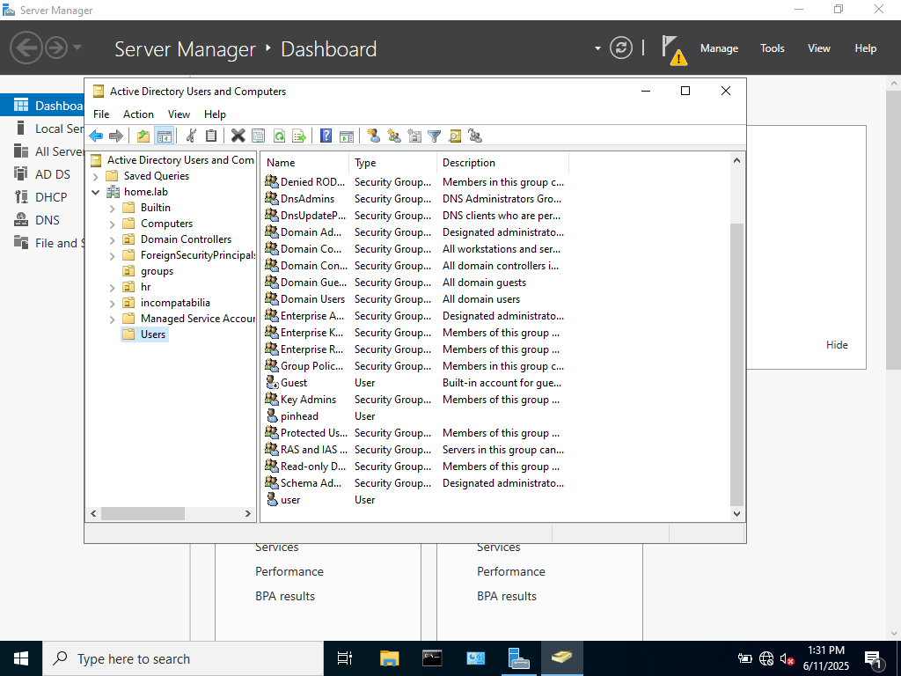
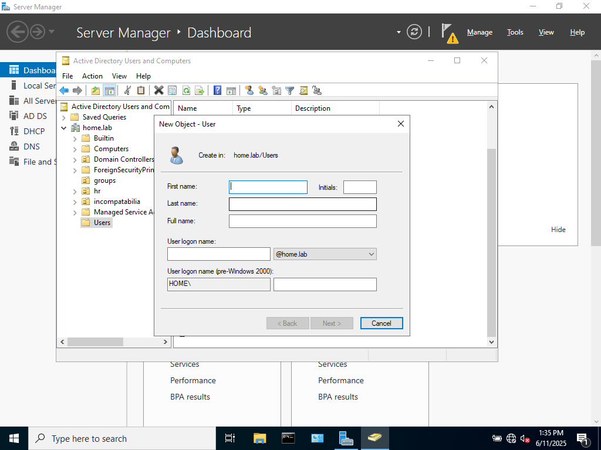
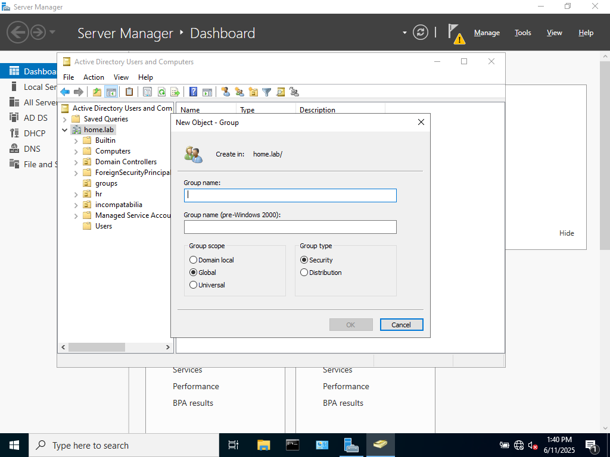
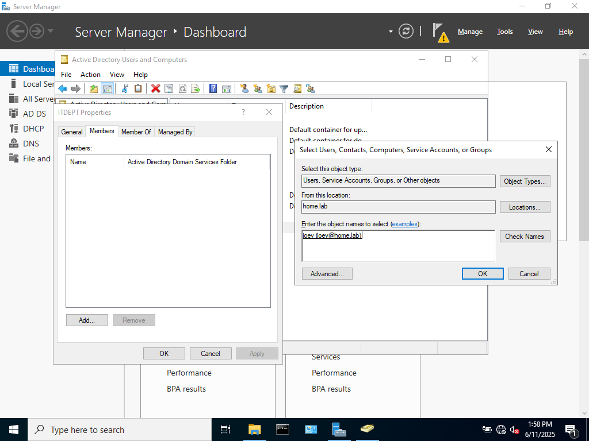
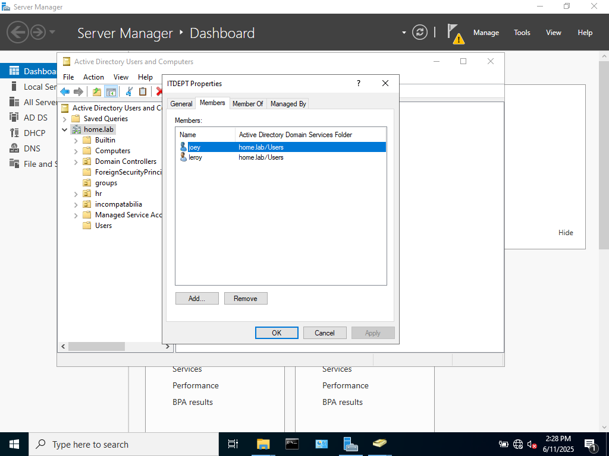

### OVERVIEW

In this lab I will demonstrate how to create users and groups in Active Directory Domain Services, and
show how to add a user to a group. 

### STEPS

Creating Users:

First in Active Directory, select Tools in the top right corner, then select Active Directory Users and Computers

This opens the Active Directory structure, where you can manage user, group, and computer objects

Right-click Users > New > User

Created several users using this method that will then be assigned to groups.

Creating Groups:

Right-click Domain (home.lab) > New > Group

Prompted to name group and select group scope and type.

For the groups created, the group scope will be global, which will enable users in this group to access shared resources throughout the domain, and the group type will be security, which allows domain management of the access to resources such as file sharing. 

After both user and group objects are created, a user can be added to a group by right-clicking the group and selecting properties then select Members > Add > enter username of member to be added > Apply

### What I learned

In this lab, I learned how to create Users and Groups in AD DS, the importance of group scope and group type, and how to add users to groups. 

### What's Next

In my next lab, I will focus on creating Organizational Units(OUs) and shared folders. The next lab will hopefully build off of the experience of this lab. 