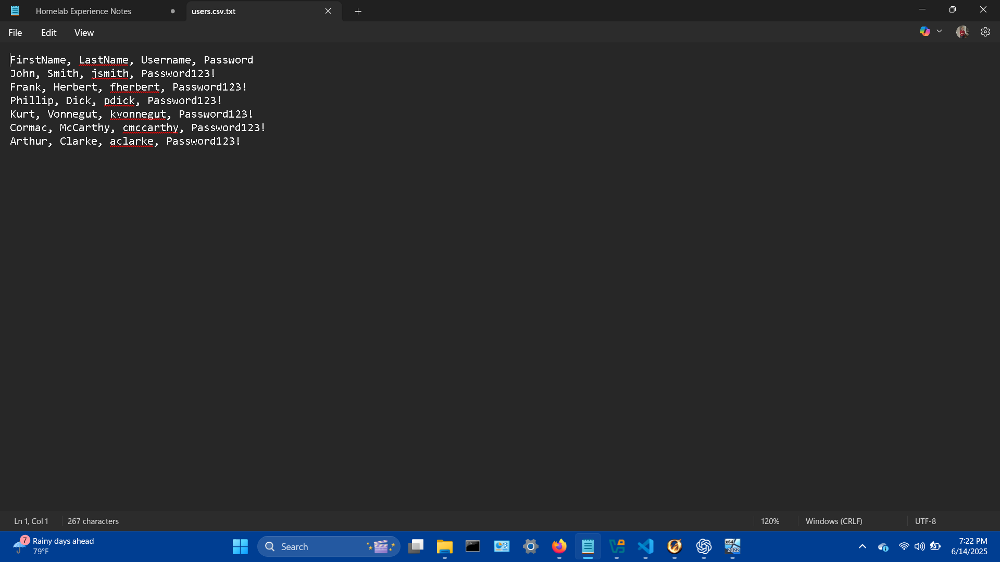
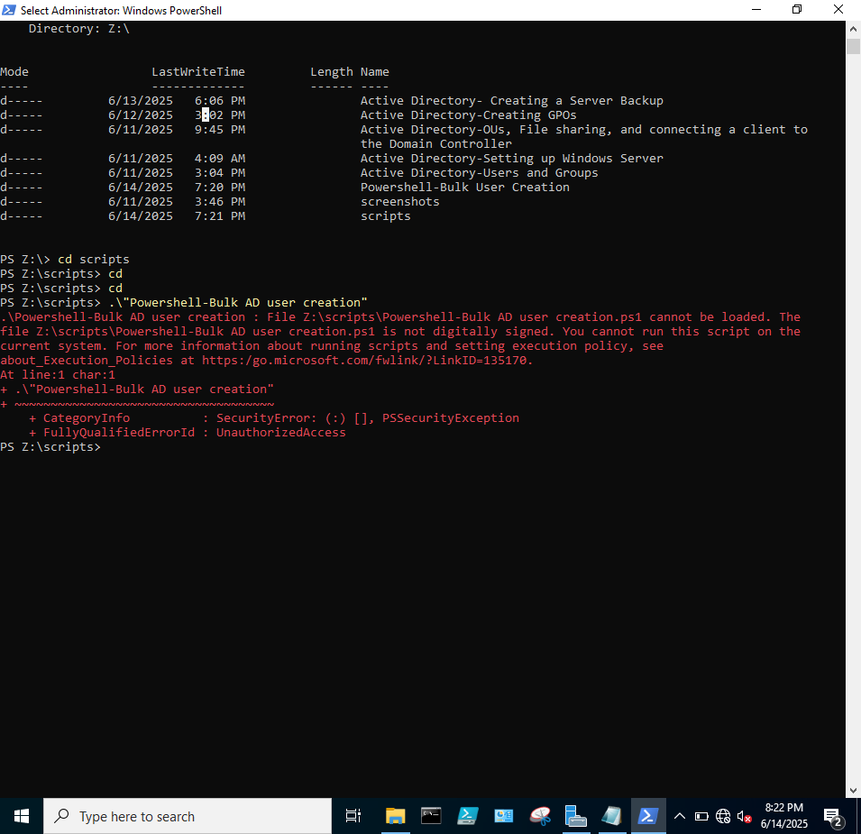
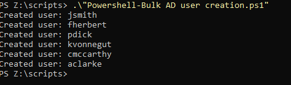
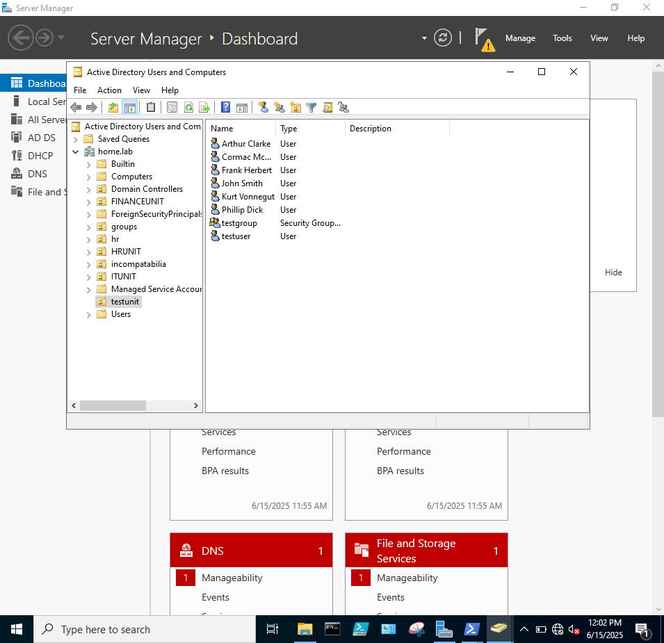

### OVERVIEW

In this lab, I will use Powershell scripts to create users and assign them to a unit in the Active Directory environment. The code will be written on Visual Studio Code, and Oracle VirtualBox will be virtualized the Windows Server with AD DS environment. 

### STEPS

First, I will create a CSV (Comma Separated Value) file to store all of the user information that I want the script to create. Without this, each user's info must be manually inserted into the script, which would be very time consuming. A CSV file will allow us to create a list of all of the users we want to create, which will then be plugged into the script to create the user accounts in Active Directory.

The CSV file will structure the data as follows: firstname, lastname, username, password. Powershell will then pull this information and create each individual user automatically. 

Next, this powershell script will be created to implant the information from the CSV file into account creation in Active Directory:

# Import Active Directory module (run on server VM)
Import-Module ActiveDirectory

# Import CSV file
$Users = Import-Csv -Path "Z:\repo\scripts\users.csv"

foreach ($User in $Users) {
    $Username = $User.Username
    $FirstName = $User.FirstName
    $LastName = $User.LastName
    $Password = $User.Password

    # Create new AD user
    New-ADUser -Name "$FirstName $LastName" `
               -GivenName $FirstName `
               -Surname $LastName `
               -SamAccountName $Username `
               -UserPrincipalName "$Username@home.lab" `
               -AccountPassword (ConvertTo-SecureString $Password -AsPlainText -Force) `
               -Enabled $true `
               -Path "OU=testunit,DC=home,DC=lab"

    Write-Host "Created user: $Username"
}

This script was written in Visual Studio Code on the host OS, which then had to be transferred to the Windows Server VM. This is done by going to the taskbar when the VM is running and selecting Devices > Insert Guest Additions CD Image which will allow for file sharing between the host and virtualized OS. 

Now with shared folders enabled, open Powershell on Windows server and navigate to the file path where the script is located.

e.g. "Z:\scripts"

With the command line in the correct directory, it is possible to run the script by typing in .\scriptname.ps1. 

e.g. .\"Powershell-Bulk AD user creation"

Recieving this error elicited some research on my part. Powershell, recognizing that the script was not created locally, blocked the execution of the script. This can be fixed with a simple bypass command:

Set-ExecutionPolicy Bypass -Scope Process

Rerunning the script allowed for the creation of users in the Active Directory environment,

