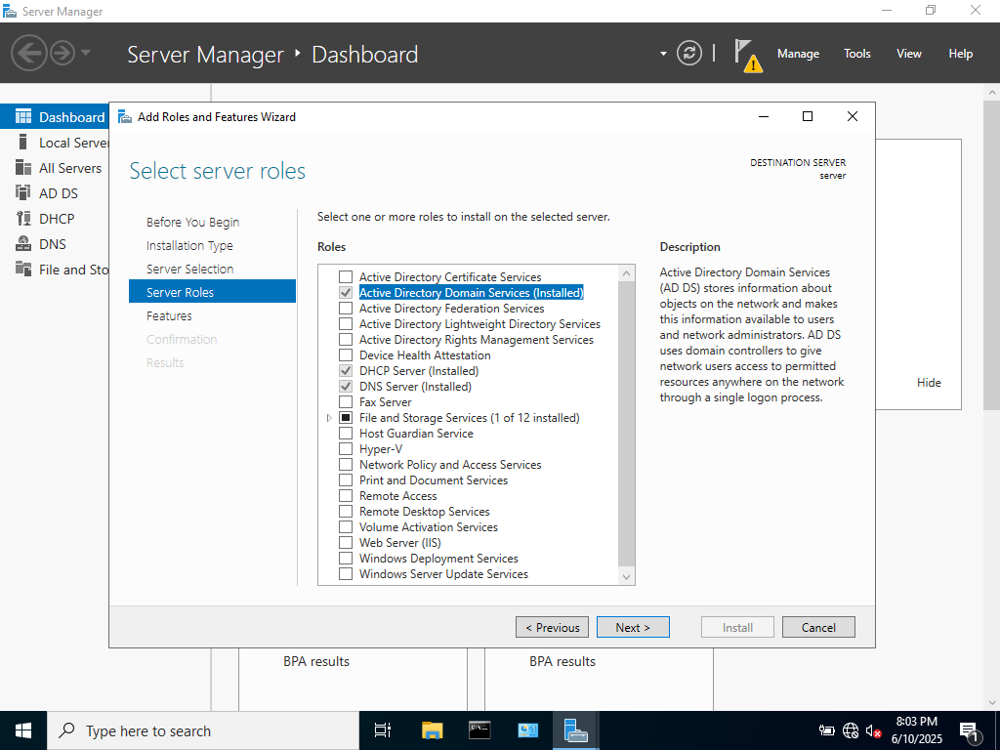
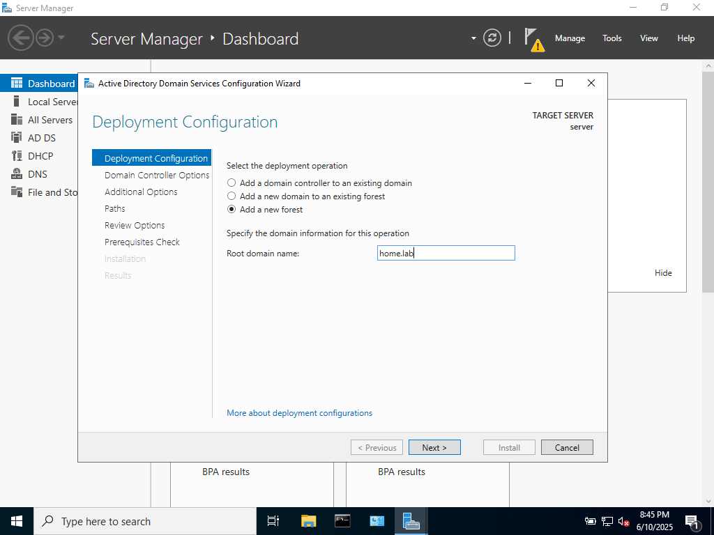

## OVERVIEW

This project concerns setting up Active Directory Domain Controller on Windows Server 2019. This server was built using Oracle VirtualBox

### Steps

I changed the VM’s network adapter from NAT to bridged mode to allow the machine to communicate directly on the local network.

After the Windows Server Installation Process, installed Active Directory Domain Services on Server Manager.

After Domain Services were installed, then set up the deployment configuration in Active Directory.

The option to add a new forest creates a new domain environment for the server. 

Once the deployment config is complete, it is important to promote the server to the domain controller.

Clicking the yellow flag will give the option to promote the server. 
